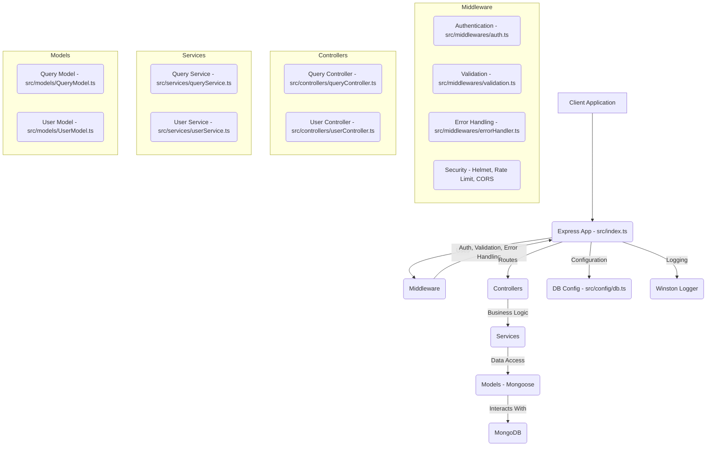

# TypeScript Enterprise MVC Backend for Software Project

This project is a TypeScript-based enterprise MVC (Model-View-Controller) backend designed for a software project domain. It provides a robust and scalable foundation for building modern web applications, featuring structured API endpoints, authentication, validation, and a clear separation of concerns.

## Architecture Diagram



## API Endpoints

| Method | Endpoint             | Description                                     | Authentication | Request Body (Zod Schema)                               | Response Body                                        |
| :----- | :------------------- | :---------------------------------------------- | :------------- | :------------------------------------------------------ | :--------------------------------------------------- |
| `GET`  | `/api/status`        | Checks the health of the API engine.            | None           | None                                                    | `{ "healthy": boolean, "engine": string }`           |
| `POST` | `/api/auth/register` | Registers a new user.                           | None           | `createUserSchema`                                      | `{ "message": string, "userId": string, "email": string }` |
| `POST` | `/api/auth/login`    | Logs in a user and returns a JWT token.         | None           | `loginUserSchema`                                       | `{ "message": string, "token": string, "userId": string, "role": string }` |
| `GET`  | `/api/auth/profile`  | Retrieves the authenticated user's profile.     | JWT Required   | None                                                    | `IUser` object (excluding pwdHash)                   |
| `POST` | `/api/analyze`       | Submits a query for AI analysis and insights.   | JWT Required   | `createQuerySchema`                                     | `{ "success": boolean, "query": string, "insights": IInsight }` |

## Setup and Running

1.  **Clone the repository:**
    ```bash
    git clone <repository-url>
    cd typescript-enterprise-mvc-backend
    ```
2.  **Install dependencies:**
    ```bash
    npm install
    ```
3.  **Environment Variables:**
    Create a `.env` file in the root directory with the following:
    ```
    PORT=3000
    MONGO_URI=mongodb://localhost:27017/software_project_db
    JWT_SECRET=your_super_secret_jwt_key_here
    ```
4.  **Build the project:**
    ```bash
    npm run build
    ```
5.  **Start the server:**
    ```bash
    npm start
    ```
    For development with hot-reloading:
    ```bash
    npm run dev
    ```
6.  **Run tests:**
    ```bash
    npm test
    ```

## Project Structure

```
.
├── src/
│   ├── config/
│   │   ├── db.ts             # Mongoose database connection
│   │   └── logger.ts         # (Auto-injected) Winston logger configuration
│   ├── controllers/
│   │   ├── queryController.ts  # Handles query analysis requests
│   │   └── userController.ts   # Handles user authentication and profile
│   ├── middlewares/
│   │   ├── auth.ts           # JWT authentication and authorization
│   │   ├── errorHandler.ts   # (Auto-injected) Centralized error handling
│   │   └── validation.ts     # Zod schema validation middleware
│   ├── models/
│   │   ├── QueryModel.ts     # Mongoose model for AI queries
│   │   └── UserModel.ts      # Mongoose model for users
│   ├── routes/
│   │   ├── queryRoutes.ts    # API routes for query analysis
│   │   └── userRoutes.ts     # API routes for user authentication
│   ├── services/
│   │   ├── queryService.ts   # Business logic for query analysis
│   │   └── userService.ts    # Business logic for user management
│   ├── validators/
│   │   ├── queryValidator.ts   # Zod schemas for query input validation
│   │   └── userValidator.ts    # Zod schemas for user input validation
│   └── index.ts              # Main Express application entry point
├── tests/
│   └── integration.test.ts   # Supertest integration tests
├── .env.example              # Example environment variables
├── package.json              # Project dependencies and scripts
├── tsconfig.json             # TypeScript configuration
└── README.md                 # Project documentation
```